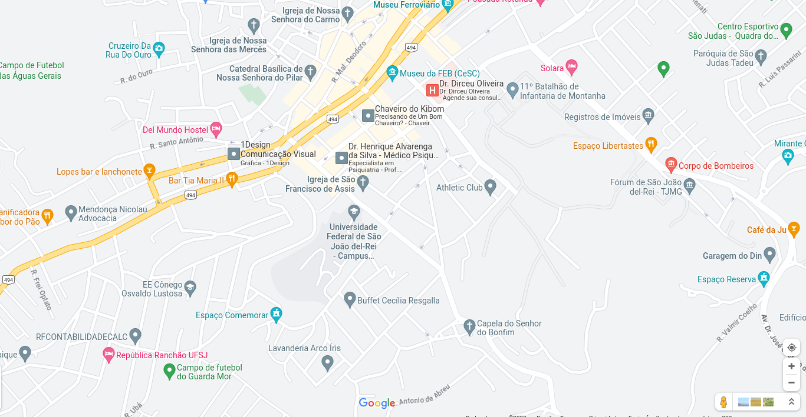
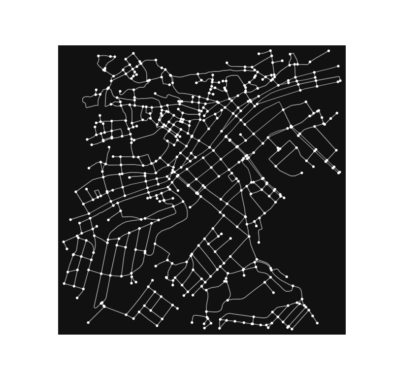

# Documentação
# Trabalho Grafo Ufsj

## Dependências
Programa foi desenvolvido utilizando java 11, não testado com outras versões.

Link da JDK utilizada para desenvolvimento, apesar de necessitar apenas da JRE.

[Java-11-Download](https://docs.aws.amazon.com/corretto/latest/corretto-11-ug/downloads-list.html)
## Como rodar o programa:
A duas formas de executar o programa:

### A primeira forma:

Utilizando uma IDE ou algo que você esteja familiarizado basta abrir a compilar o projeto para gerar a ".class"
o projeto e executar a classe main. O programa já possui uma entrada predefinida sjdr.gml, por enquanto não
suporta a execução de um arquivo em específico e é claro ao permitir essa possibilidade o arquivo deveria seguir
o padrão do mesmo.

Arquivo de entrada [sjdr.gml](src/main/java/input/sjdr.gml)

### Segunda forma:

**Levando em consideração que você esteja com o terminal aberto na pasta do projeto:**

Já deixei um Makefile configurado e um *".jar"* pronto para execução basta rodar o programa com:
```bash
make rodar_programa_preparado
```
*Comando 1*

Ou se caso você queira compilar o pacote você mesmo basta rodar o seguinte comando:

```bash
make
```
*Comando 2*

E apos isso rodar o comando:
```bash
make rodar_programa_preparado
```

### Resposta esperada (versão resumida):
```bash
Monitorando ruas:
        Rua:--Rua Sem Nome 120--
        Rua:Travessa do Ouro
        Rua:Travessa do Ouro
Vertice id = 536, label = 3617482447
Monitorando ruas:
        Rua:Rua Sebasti&#227;o Neri
        Rua:Travessa Andrel&#226;ndia
        Rua:Rua Sebasti&#227;o Neri
Vertice id = 540, label = 3617578690
Monitorando ruas:
        Rua:--Rua Sem Nome 117--
        Rua:Travessa Toledo
Total de cameras posicionadas = 308
Total de ruas monitoradas = 771
```

## Problema:
A prefeitura de São João del-Rei contratou uma empresa para projetar um sistema de vigilância por câmeras 
na cidade. A região escolhida para o fase piloto do projeto é o centro da cidade, mais especificamente, 
ma região num raio de 1km do Campus Santo Antônio da Universidade Federal de São João del-Rei. 
A figura abaixo apresenta uma visualização da região de interesse.



A câmera definida para realizar a vigilância deve ser posicionada em uma esquina e realiza filmagens em 360º, sendo 
capaz de monitorar todas as ruas ligadas pela esquina onde está posicionada.

Um dos objetivos do projeto é reduzir o custo. Para isso, é preciso posicionar o menor número possível de câmeras 
capazes de monitorar todas as ruas da região.

A equipe de projeto definiu que o método de solução do problema seria através de grafos e, por isso, modelou o centro 
da cidade de São João del-Rei como uma rede em que as esquinas são representadas por vértices e as ruas são 
representadas por arestas. A figura abaixo apresenta visualmente o grafo que representa a região de interesse.



Obtenha uma solução para o problema apresentado. Você deve fornecer a lista de esquinas nas quais serão instaladas as 
câmeras e as ruas monitoradas por cada uma das câmeras.

Para isso, implemente um algoritmo capaz de obter uma cobertura minimal, utilizando qualquer solução heurística que você
conseguir elaborar. O arquivo "sjdr.gml" oferece uma representação do grafo da região de interesse, que pode ser lido 
e manipulado por qualquer biblioteca de grafos. Os nós são representados por íncices numéricos e as ruas estão 
representadas como atributos das arestas com o nome 'name'.

## Solução:
O algoritmo para solucionar o problema do minimo de posicionamento de camêras para vigiar o quarteirão
é um algoritmo guloso que funciona da seguinte forma:
[SecurityCameraPlacementHeuristic](src/main/java/api/securitycameraplacement/SecurityCameraPlacementHeuristic.java)
```java
/**
 * O grafo residual serve para auxiliar as marcações no grafo original
 */
public class SecurityCameraPlacementHeuristic {
    
    public final Graph<Vertex, Edge> graph;

    public SecurityCameraPlacementHeuristic(Graph<Vertex, Edge> graph) {
        // Recebe o grafo inicializado no construtor considera o grafo ser não direcionado
        this.graph = graph;
    }

    public void greedyAlgorithmSolution() {
        // Copia o grafo original
        Graph<Vertex, Edge> residualGraph = graph.copy();
        // Inicializa um set para marcar arestas que já estão sendo vigiadas por outro vértice
        Set<Long> markedIds = new HashSet<>();

        // Itera sobre cada vértice do grafo residual
        for (int i = 0; i < graph.getSize(); i++) {
            // Recebe todos os vértices do grafo residual
            List<Vertex> vertexs = new ArrayList<>(residualGraph.getAllVertexes());
            // Ordena de acordo com o número de arestas que partem de respectivo vértice
            vertexs.sort(new VertexComparator(residualGraph));
            
            // No caso esse é o vértice com o maior número de arestas relaciondas
            Vertex firstToRemove = residualGraph.findVertexById(vertexs.get(0).getId());
            
            // Se o número de vizinhos é 0 finaliza o programa, pois todas as camêras já foram posicionadas
            if (residualGraph.getNeighborsCount(firstToRemove) == 0) {
                break;
            }
            
            // Procura o vértice com maior número de arestas no grafo original e posiciona uma camera no mesmo
            Vertex monitoredVertex = graph.findVertexById(vertexs.get(0).getId());
            monitoredVertex.setSecurityCamera(true);
            
            // Lógica para identificar qual vértice está monitorando determinada aresta, marcando cada uma
            Set<Edge> allEdgesFromMonitored = graph.getEdges(monitoredVertex);
            for (Edge edge : allEdgesFromMonitored) {
                if (edge.isValid() && !markedIds.contains(edge.getDestination().getId())) {
                    edge.setVertexMonitoring(monitoredVertex);
                    markedIds.add(edge.getSource().getId());
                }
            }
            
            // Remove vértices e aretas relacionadas a ele no grafo residual
            residualGraph.removeVertex(firstToRemove);
        }
    }
}
```
### Saída
**O algoritmo imprime todos os vértices no qual foram posicionadas caméras e as respectivas ruas vigiadas pelo mesmo,
além de mostrar o número total de ruas do grafo e o total de camêras que foram posicionadas.**

Link do Repositório: [Geraldo-Arthur-Repositorio](https://github.com/ArthurDetomi/Camera-Monitoramento)

Copyright (c) <2023> <[Geraldo Arthur Detomi](https://github.com/Arthurdetomi)>
